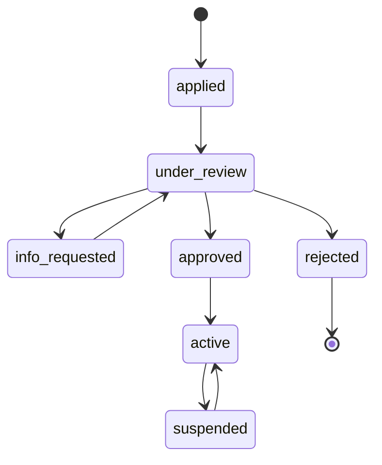
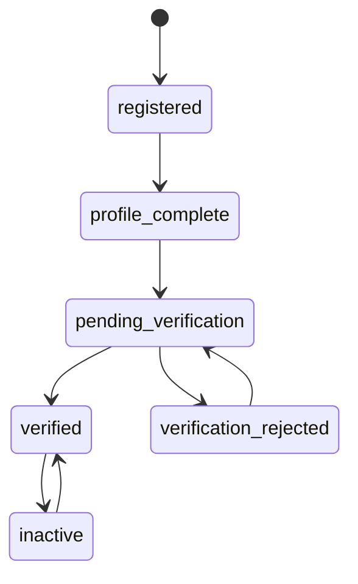
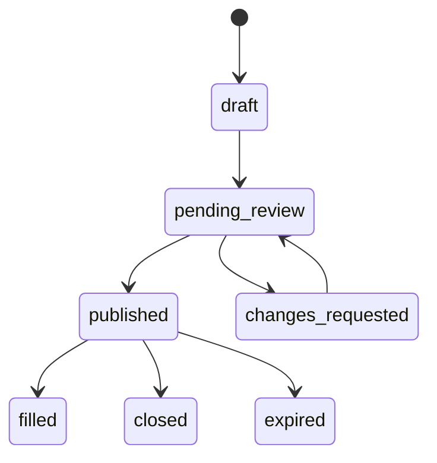
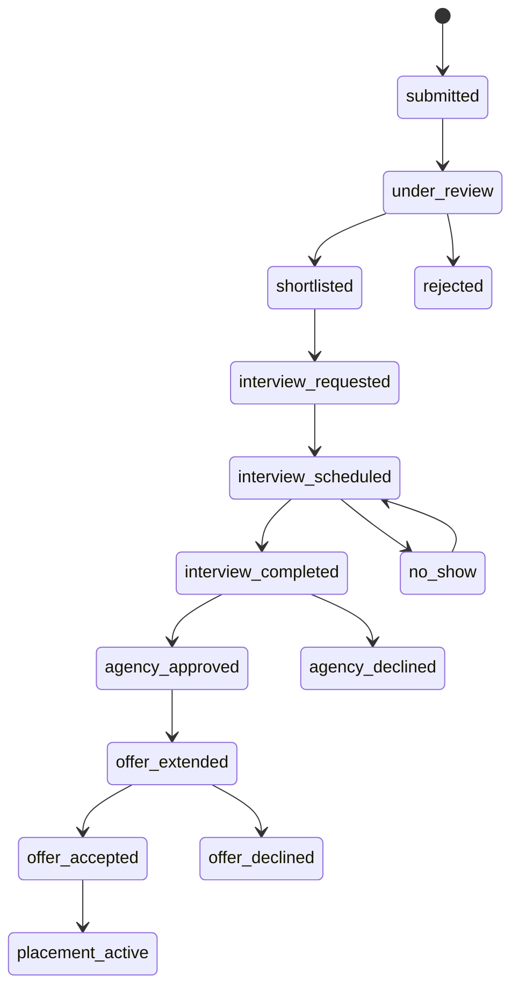
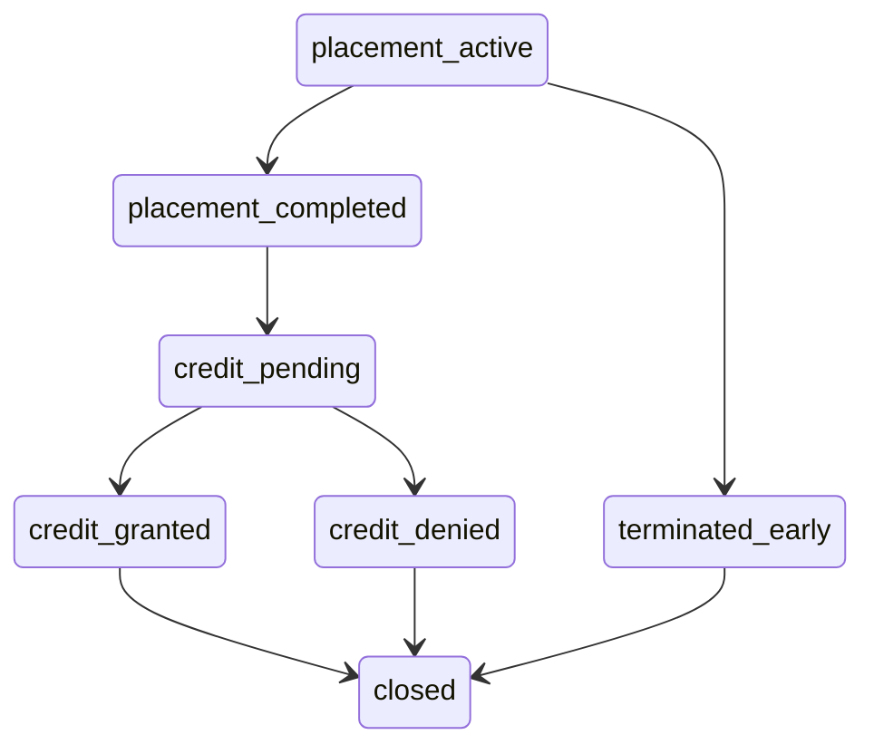

# Opportunity Ecosystem — End-to-End User Story

**Status:** Draft for review. Nothing here is settled.
**Purpose:** Pin down the complete lifecycle before writing application code, so the domain model and state machine are built once.

Open questions are marked **[Q1]**, **[Q2]**, … and collected at the end. Assumptions I made to keep the story moving are marked **[assumed]** — treat every one of them as a question I answered on your behalf.

---

## The actors

| Actor | Who they are | What they own |
|---|---|---|
| **Admin** | The platform operator. The customer this is built for. | Vetting, oversight, intervention, reporting, configuration |
| **Student** | HS or college job seeker | Their master profile, applications |
| **Employer** | Approved business hosting interns | Postings, candidate decisions, supervision |
| **Education** | High school district or PSU | Roster verification, credit awards |
| **Agency** | KANSASWORKS / state workforce | Interview slots, workforce sign-off |

**Admin is the only cross-tenant role.** Every other actor sees only their own organization's data. That exception is deliberate, and every cross-tenant read gets logged.

---

## Phase 0 — Onboarding an organization

Nothing exists until Admin lets it exist.

1. Admin configures the program: counties in scope, whether the agency interview is required, which credit types are allowed, SLA thresholds for stalled work.
2. An organization applies through a public form — legal name, state registration, county, org type, primary contact.
3. Admin vets it. For an employer that means confirming it's a real, registered, in-good-standing Kansas business. For a school, that it's a real accredited institution.
4. On approval the primary contact is invited to create an account and becomes that org's own admin, who can then invite colleagues.

This queue is your mockup's *"Pending Entity Vetting — 3 Organizations."* It is the trust foundation of the whole program: schools will only participate if someone credible vetted the employers their 16-year-olds are being sent to.

---

## Phase 1 — Student onboarding and verification

1. Student self-registers and selects their institution **from the list of already-approved institutions**. They can't invent one.
2. Student builds the **master profile** — the thing they build once and reuse forever:
   - Education history, expected graduation
   - Skills, on a shared taxonomy (see [Q6])
   - Career interests / pathways
   - Availability: terms, hours per week, **and transportation** (see [Q7])
   - Resume, portfolio links
3. **The institution verifies them.** A counselor sees the student in a pending-verification queue and confirms: our student, this grade, this ID, in good standing, eligible for internship-for-credit.
4. Verified students get the badge in your mockup. **Unverified students may browse but may not apply.** [assumed] — browsing is the carrot that gets them to finish verification.

**Minors:** if DOB indicates under 18, a guardian record and consent artifact are required before verification completes. Modeled now, dark at launch (college-first), per your call.

---

## Phase 2 — Employer posts an opportunity

An approved employer creates a posting: title, description, county and work arrangement, term and dates, hours per week, **wage** (required — this is a paid-internship program), required and preferred skills, whether it's credit-eligible and for roughly how many hours, the assigned supervisor, and the number of openings.

**[Q1] Does Admin review every posting?** Three options: auto-publish for approved employers; review the first posting from each employer then auto-publish after; review everything. Given minors and academic credit are attached, I'd lean to the middle option — but this is a workload decision for whoever staffs the admin desk, so it should be a configuration setting rather than a hardcoded rule.

---

## Phase 3 — Discovery and application

Student browses and searches. Each posting shows a **match score** — computed from skill overlap, location and transportation fit, availability, and credit fit.

Two rules about that score, and they matter:
- It is **explainable**. Stored with the factors that produced it and the version of the algorithm that produced it, because employers will ask "why 94%?" and someone will eventually audit it for bias.
- It **sorts, it never gates**. No student is ever filtered out of an employer's view by a score.

"1-Click Apply" works because the master profile already carries everything. The student adds at most a short interest statement.

**[assumed]** The student's institution is notified when they apply — informational, not an approval step. Counselors want to know their kids are active.

---

## Phase 4 — Employer review

Employer works the candidate pipeline (the table in your mockup): shortlist, reject, or request more information.

Critically, **the employer does not see full contact PII at this stage** — not a phone number, not a home address. That unlocks later, and for minors it unlocks later still. Field-level disclosure is a property of the profile, not of the screen rendering it.

---

## Phase 5 — The Kansas Workforce interview

This is the distinctive step, and the one I most need you to correct me on.

As drawn: employer shortlists → employer requests a KS interview → agency publishes slots → student books one → Zoom session happens → agency officer signs off → candidate is cleared.

**[Q2] Is the interview per-application, or once per student per term?**

This is the highest-leverage question in the document. As drawn it's per-application — which means a student applying to five employers sits through five state interviews, and the agency's workload scales with *applications*, not with *students*. That will not survive contact with volume.

The alternative: the interview is a **workforce-readiness credential the student earns once per term**. Agency interviews the student, signs off, and that clearance travels with them to every application that term. Agency workload scales with students, the student's experience is dramatically better, and employers get pre-cleared candidates instantly instead of waiting a week.

If the state's requirement is genuinely about validating *each placement* rather than each participant, the per-application model is forced. If it's about participant readiness and intake, the credential model is strictly better. Worth confirming with whoever wrote the requirement.

**[Q3] Who attends?** Your mockup reads "Alex Miller ↔ Apex Robotics," which suggests employer and student together. Student-only is a readiness screen; joint is a placement validation. Different meanings, different scheduling complexity.

**[Q4] Where does the gate sit relative to the hiring decision?** As drawn, the agency screens candidates the employer hasn't committed to hiring. Flipping it — employer extends a conditional offer, agency validates, offer confirms — cuts agency volume hard and only interviews people who are actually about to be placed.

---

## Phase 6 — Offer and placement

Employer extends an offer with role, wage, dates, hours, and supervisor. Student accepts (guardian co-signs if a minor). The institution confirms the credit arrangement: how many credits, mapped to which course, with what learning objectives and which faculty supervisor.

**Credit is not one thing.** A high school granting credit toward graduation and PSU granting college credit hours are different objects with different scales and different approvers. One generic `credits: 3` field breaks the first time both institution types are live.

---

## Phase 7 — The placement runs

- Student logs hours; supervisor approves them. This feeds both wage verification and credit.
- Midpoint check-in **[Q5]** — does anyone formally check in partway through?
- Supervisor completes an end-of-placement evaluation.
- **An escalation path exists.** Any party can raise a problem — safety, no-shows, conduct — and it routes to Admin. With minors in the program this is not optional, and it needs to exist before the first HS student is placed.

---

## Phase 8 — Credit and closeout

Institution reviews hours logged, the supervisor evaluation, and the student's reflection, then grants credit. The credit award writes back to the student's profile as **verified completed experience** — which is the compounding value of the whole system. After two placements a student carries a work record that a school and a state agency both attested to.

---

## Phase 9 — Admin oversight (continuous, not sequential)

This runs across every phase above, and it's the product.

**Oversight.** One view of every application in flight across all five parties. The useful version isn't a list — it's *exception-first*: what's stuck, who's sitting on a queue past SLA, which postings have no applicants, which students verified but never applied. Admin's job is unsticking things, so the screen should lead with what's stuck.

**Vetting.** The org approval queue, plus visibility into student verification across institutions.

**Reporting.** Rolled up from the audit event log rather than computed ad hoc: placements by county, credit hours granted, wages earned by students, employer and school participation, time-to-placement, funnel conversion at each stage. This is what justifies the program to the state and to funders.

**Intervention.** Admin can nudge a party, reassign, or force a state transition — always with a reason, always logged.

**Audit.** Every transition writes an immutable event: who, what, when, why. This is also what makes the reporting free.

---

## Open questions

| # | Question | Why it matters |
|---|---|---|
| **Q1** | Does Admin review every posting, first-only, or none? | Admin desk workload; should probably be configurable |
| **Q2** | Is the agency interview per-application or once per student per term? | **Biggest question here.** Determines whether agency workload scales with applications or with students |
| **Q3** | Is the interview student-only or student + employer? | Changes what the interview *means* and how hard it is to schedule |
| **Q4** | Does the agency gate sit before or after the employer's hiring decision? | Order-of-magnitude difference in agency volume |
| **Q5** | Is there a formal midpoint check-in during a placement? | Adds a state and a notification cycle |
| **Q6** | Skills taxonomy: adopt O\*NET, or roll our own tags? | O\*NET is federal, free, and state workforce systems already speak it — but it's coarse for HS-level skills |
| **Q7** | Is transportation a first-class matching factor? | In rural SE Kansas a student without a car cannot take a placement 30 miles away. If it's not modeled, matches will be wrong in a way that's invisible on screen |
| **Q8** | **Are adult job seekers in scope?** | Your landing page says "Job Seekers," but every other screen says "Student." An adult career-changer has no institution to verify them and wants no academic credit — that's a different lifecycle, missing Phases 1.3 and 8. Either it's out of scope, or it's a second track |
| **Q9** | Can one posting produce multiple placements? | "3 openings" is common; affects whether posting→placement is 1:1 or 1:N |
| **Q10** | Does a profile follow a student from HS to PSU? | If yes, profile ownership can't be tied to one institution |

---

## What this buys us

Once Q1–Q10 are answered, the state machine above becomes a single guarded transition table with a permission matrix — who may move what, from where, to where. Every one of the five portals is then a filtered query over that one table.

That table is the foundation. Build it right and the five portals are views. Build five portals first and you get five divergent truths.
