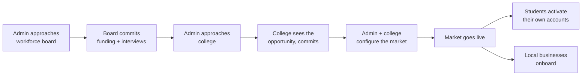
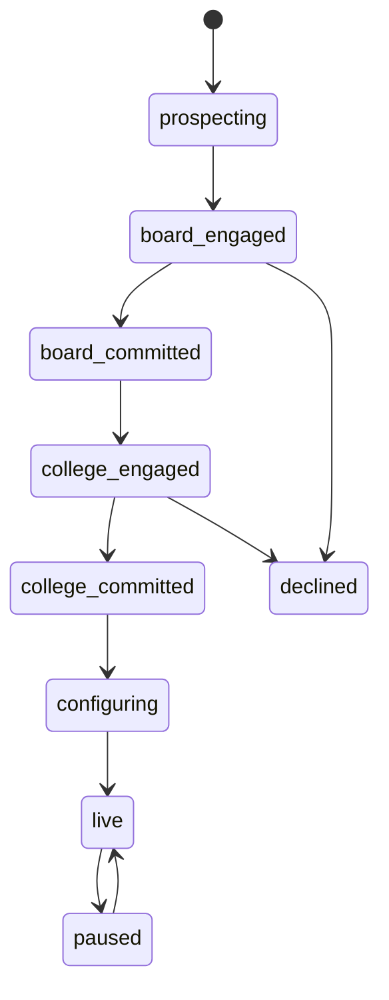
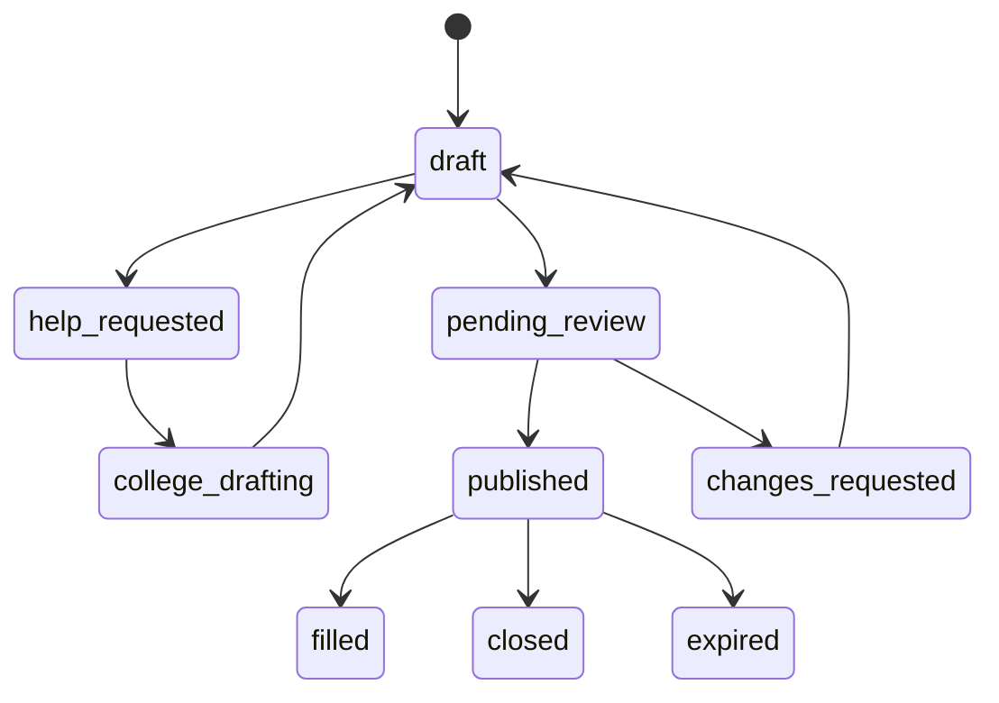
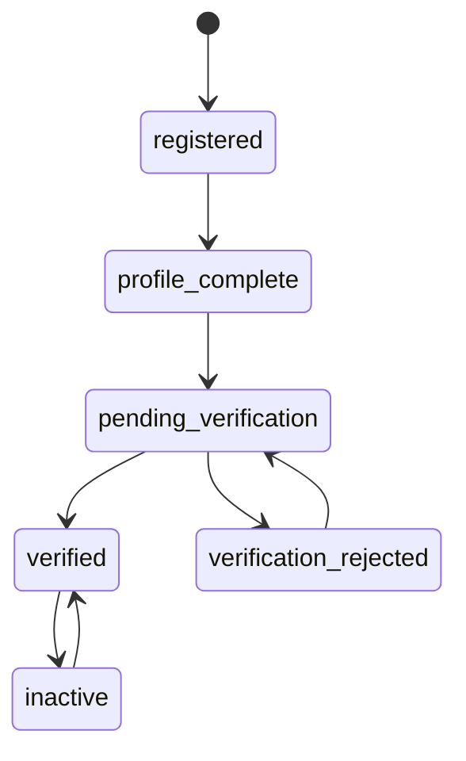
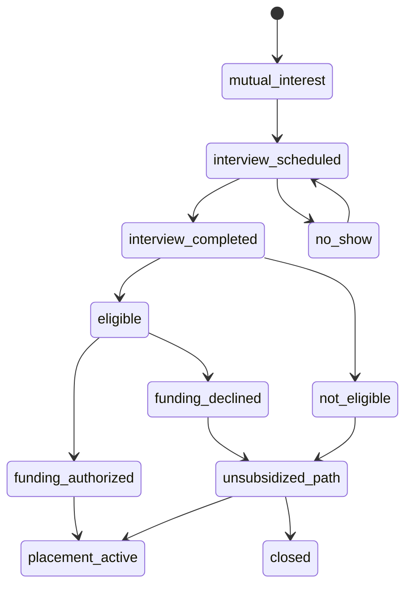
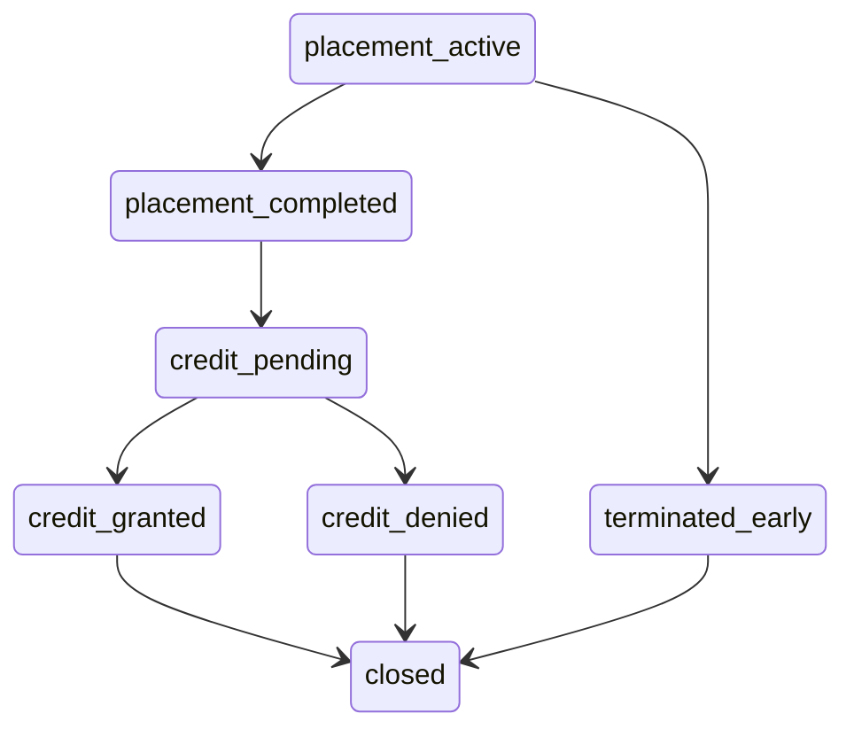

# CCLN — End-to-End User Story

**Status:** Draft, under active revision.
**Purpose:** Pin down the complete lifecycle before writing application code, so the domain model and state machine are built once.

Open questions are marked **[Q#]** and collected at the end. Assumptions are marked **[assumed]** — treat every one as a question I answered on your behalf.

---

## The shape of the thing

This is not a national platform that organizations sign up for. It is a **program the administrator launches city by city**, and nothing exists in a city until the administrator has put the pieces in place.

The launch sequence is the product's real spine:

The workforce board comes **first** because the board is what makes the program worth anything — it brings the money. The college comes second because the board's participation is the pitch. Students and businesses come last, and they self-serve.

### Markets are the tenancy root

That sequence means there's a top-level entity the current model is missing entirely: a **Market** — a workforce board, one or more colleges, and a geography, launched by Admin as a unit. Every student, business, posting, and placement belongs to exactly one.

This is the correct root of the data model, and it changes what the admin console *is*. Admin's primary job isn't reviewing applications — it's **launching and running markets**. The pipeline they care most about is Wichita at "board committed, college pending," not any individual student.

**[Q16]** Naming — Market, Region, Site, Chapter? And can one board anchor multiple colleges, or is it one board to one college? WIOA local areas and college service areas don't align cleanly, so I'd assume one board to many colleges. [assumed]

---

## The interview is a wage subsidy determination

This is the single most important correction, and it changes the meaning of the step I had modeled as compliance.

What actually happens in Kansas:

1. The internship gets coordinated and **the student and the business agree they're interested**.
2. **Everything pauses.**
3. The student contacts the workforce board, schedules an interview, and goes through it.
4. If the board agrees, **the board pays the business $20/hour**, and the business pays the student's wage out of it.

So the interview isn't a readiness screen or a compliance checkbox. **It's the eligibility determination for a wage subsidy.** Money is attached, which is why it's mandatory and why everything stops until it clears.

Three consequences fall out immediately.

**The $20/hour is the business's entire reason to participate.** It should be the loudest thing on the employer-facing pages — not a detail buried in a workflow. "Host an intern, get reimbursed $20/hour" is the pitch. The current mockup doesn't mention it anywhere.

**The pause is a real product problem, and closing it is the product's value.** Right now that gap is where placements die: mutual interest is established, then the student has to independently figure out how to contact a workforce board and book an interview. Every day in that gap is a chance for the student to disengage or the business to move on. **Compressing that pause is the most valuable thing this system can do** — surface it the instant mutual interest is recorded, show open board slots inline, book in one click, notify all three parties. That single sequence probably justifies the platform on its own.

**[Q4] is answered by this.** The gate sits *after* mutual interest and *before* the placement starts. Not before shortlisting.

### Clearance is per applicant, per job — **resolved**

Not a portable credential. Every standard application gets its own board interview, because the board is assessing *this placement*, not certifying the person once and letting it travel.

| | **This application's clearance** | **Funding authorization** |
|---|---|---|
| About | This student, for this job | What to actually commit |
| Determined by | An interview, every time | The board, against its allocation |
| Frequency | Every standard application | Every funded placement |
| Answers | "Do we back this pairing?" | "At what rate, for how many hours?" |

**The consequence to plan for:** board interview volume tracks *applications*, not students. A student pursuing three standard roles books three interviews. At 10 students × 3 applications that's 30 interviews a term, and slot supply becomes the program's binding constraint well before employer or student supply does.

Two mitigations exist inside this model if volume becomes a problem: cap concurrent standard applications per student, or move the gate later so the board only interviews candidates an employer has committed to hiring — the Q4 conversation you're writing up.

One sub-decision made in code and easy to flip: a student the board has determined **not eligible** is blocked from booking again, on the reasoning that WIOA participant eligibility is about the person's circumstances rather than the job. Their placements continue on the unsubsidized path. If a fresh determination should be allowed for each employer, that's a one-line change to the guard.

### The budget is finite, and that changes everything

If this is WIOA money — and $20/hour wage reimbursement strongly suggests work-experience funds — then **each board has a fixed pot per program year.**

That makes subsidy a **scarce, allocated resource**, not an entitlement, and it has consequences the model has to carry from the start:

- A market has a **budget and a burn rate.** Admin needs to see committed vs. remaining, per board, per year.
- Placements **consume** budget. Approving a 400-hour placement at $20/hr commits $8,000.
- When the pot runs low, the board starts saying no, and the system needs to represent that gracefully rather than leaving students stuck in a pause that never ends.
- **Not every student will qualify.** WIOA eligibility turns on category and circumstance, not enrollment. So some placements are subsidized and some aren't — the system must handle both, and the unsubsidized path can't be a dead end. **[Q18]**

Admin's reporting job is therefore partly **budget stewardship**: how much of the board's allocation did this program deploy, into which counties, producing how many placements and credit hours. That's the number that gets the board to renew.

### Hours logging is load-bearing

Because reimbursement is hourly, **logged hours are the basis of a funding claim** — not just an academic record. If the platform is the system of record for hours, it feeds both the credit award and the board's reimbursement. That raises the bar on hour logging considerably: supervisor approval, immutability after approval, correction with an audit trail.

**[Q19] is resolved: the platform is the system of record.** Which settles the shape, because hours turn out to be the one record every party needs and none of them owns alone:

| Party | Role | What they need from it |
|---|---|---|
| Student | Logs the week | To be able to correct a week that was sent back |
| Employer | **Validates it** | The work description, to approve against |
| College | Awards credit | The work description, because credit is a judgement about work done |
| Board | Reimburses | Hours and periods, priced against the authorization |

The employer's approval is the whole evidentiary basis. They are the only party who can attest the student was there — not the college, which awards credit but was not present, and not the board, which pays but was not present either. Self-reported hours that nobody countersigns are not something public money can be reimbursed against, which is why logging and approving are two actions by two roles rather than one.

Two consequences that were not obvious before building it:

- **Approved hours can exceed the authorized cap.** A supervisor approving a genuine week does not know what the board committed three months earlier, and telling them to refuse real work because a budget line ran out would be both wrong and unenforceable. So the overage is surfaced, not prevented — and the employer carries it. Silently reimbursing past the cap overspends the allocation; silently dropping the hours hides a bill the employer is about to receive.
- **A placement cannot be completed over unreviewed weeks.** Closing it strands those hours: they reach neither the credit total nor the reimbursement claim, and a student cannot reopen a completed placement to chase them.

**Data minimisation falls out of the same table.** The board sees hours and periods; it does not see the work summaries, because pricing a claim against an hour cap does not take a description of what the student built. Holding one would give a government agency a weekly diary of a named student's activity that it has no need for and that, once held, becomes subject to retention and open-records questions it would rather not answer. Collect once, disclose per purpose.

---

## The college is the intermediary, not a verifier

I had the college as a roster-verification and credit-granting queue. It's much more than that — it's the **local operator of the market**.

The college:
- Recruits and verifies students
- Brings businesses in and vouches for the program locally
- **Helps businesses that don't know how to write a job description**
- Brokers and nudges matches
- Sets credit policy and grants credit

That fourth item is a real feature, not a footnote. A small manufacturer who has never hosted an intern does not know how to write a scoped, credit-appropriate posting — and a bad description produces bad matches, or no applicants at all.

So postings need **assisted drafting**: a business can request help, and the college can co-edit, comment, or start from a template. The posting flow becomes collaborative, with a `needs_help` state that routes to the college's queue.

More generally: **the system's job is smoothing over pain points at handoffs.** Every place one party waits on another is a place the program leaks. The pause before the board interview is the biggest. Assisted posting drafting is the second. Those two deserve deliberate design rather than a queue and a hope.

---

## The two tracks, revisited

### What Parker Dewey micro-internships actually are

Checked against Parker Dewey's own materials and partner career-center pages rather than memory:

| Attribute | Reality |
|---|---|
| Hours | **5–40 total** — not 10–40 |
| Turnaround | Due one week to one month after kickoff |
| Payment | **Fixed project fee, not hourly.** The company sets the fee; 90% goes to the student |
| Location | **~90% remote** |
| Selection | Student expresses interest, company picks, work starts. No interview |
| Academic credit | **Not built in.** Parker Dewey defers entirely to each institution and offers to share completion data "for credit consideration" |
| Framing | A "working interview" — real work, seen before anyone commits, no conversion fee to hire |

Three of those cut against the current design.

### Problem 1: fixed fee is mechanically incompatible with the subsidy

The board reimburses **$20 per hour**. A Parker Dewey-style micro-internship has a **fixed project fee and no tracked hours** — there is nothing to reimburse against. This isn't a policy question, it's an arithmetic one.

So Q13 resolves itself: **micro-internships can't be hourly-subsidized without abandoning the fixed-fee model.** Which is good news — it means no eligibility determination, no pause, and the track keeps the low friction that is its entire reason for existing.

### Problem 2: the credit math doesn't work

This is the serious one. One college credit is roughly **45 hours** of student work. Micro-internships run **5–40 hours**, with many at the low end.

**A single Parker Dewey-style micro-internship cannot carry 1 credit at most registrars.** Even a maximum-length 40-hour project falls short of the threshold, and a 10-hour project isn't remotely close.

That reframes Q15 completely. The question was "do micro-internships stack toward *more* credit?" The real question is that **stacking is required to reach even one credit**:

> 3 micro-internships × 15 hours = 45 hours = 1 credit

Which changes the model: `CreditAward` is **many-to-many with placements from the start**, accumulating hours across completed micro-internships until a threshold is met. Not a one-to-one relationship I can loosen later.

Three ways out — worth deciding before the model hardens **[Q21]**:

- **Stack them.** Students bank micro-internships until they clear the hours floor. Truest to Parker Dewey, most work to model, best student experience.
- **Make this program's micro track bigger.** Define it at 45+ hours so one project equals one credit. Simple, but it's no longer really a micro-internship and loses the fast turnaround.
- **Micro is non-credit.** Purely a working interview and an on-ramp to a standard internship. Simplest by far, but it drops the "1 credit" you specified.

### Problem 3: remote conflicts with local workforce funding

~90% of Parker Dewey projects are remote, and companies can be anywhere. A *local* Kansas workforce board funds *local* economic development — a remote project for an out-of-state company is outside its mandate.

For this program the micro track probably has to be scoped to **local Kansas businesses**, which is a deliberate departure from Parker Dewey's national remote marketplace. Worth naming as a differentiator rather than treating as a constraint. It also happens to make micro-internships work for rural students without a car.

### What's genuinely worth stealing

The **working interview** framing is the right pitch for a small Kansas manufacturer who has never hosted an intern and finds a full semester commitment intimidating. Start with a 20-hour project, see the work, then commit.

That makes **micro → standard a designed funnel**, not two disconnected products: a completed micro-internship should convert to a standard internship offer in one click, carrying the work history with it. That's a feature the mockup should show.

### Revised track comparison

| | **Standard Internship** | **Micro-Internship** |
|---|---|---|
| Credit | 3 credit hours | 1 credit, likely stacked **[Q21]** |
| Duration | Semester or summer | One week to one month |
| Hours | ~135–150 | 5–40 |
| Payment | Hourly wage | Fixed project fee |
| Shape | Ongoing role with a supervisor | Discrete project with a deliverable |
| Board subsidy | **Yes — $20/hr** | **No** — fixed fee has no hours to reimburse |
| Board interview | Required | Not needed |
| Location | Local | Local for this program, though the model is usually remote |

**[Q11]** The hours floor per credit stays institution-configurable and enforced at posting time — it just now governs an accumulated total rather than a single placement.

---

## The actors

| Actor | Who they are | What they own |
|---|---|---|
| **Admin** | The platform operator. The customer this is built for. | Launching markets, orchestration, unsticking handoffs, reporting |
| **Workforce Board** | The local workforce board | Clearance interviews, funding decisions, the budget |
| **College** | Local institution, the market's operator | Student verification, business assistance, credit policy, credit awards |
| **Business** | Approved local employer | Postings, candidate decisions, supervision, hour approval |
| **Student** | Student earning college credit — enrolled at a college, or at a high school through dual/concurrent credit | Master profile, applications, hour logging |

**Admin is the only cross-market role.** Everyone else sees one market. That exception is deliberate and every cross-market read is logged.

---

## Phase 1 — Student onboarding

Students self-activate once their market is live. They register, select their college from that market, and build a **master profile**: program of study, standing, expected graduation, skills **[Q6]**, career interests, availability, resume.

The college verifies them — our student, this program, in good standing, eligible for internship-for-credit. **Unverified students may browse but may not apply.** [assumed]

Guardian consent and under-18 PII gating are **not** in the schema — there is no guardian, date-of-birth, or age field anywhere in the model. This was previously written up as "in the schema but unreachable," which was wishful.

It matters now that dual-credit high school students are in scope: nothing distinguishes a sixteen-year-old from a college sophomore, so nothing can apply the consent rules or the paid-work hour limits that follow from being a minor. See [`security-and-data.md`](security-and-data.md) §2 and §3a.

---

## Phase 2 — Business onboarding and posting

A local business joins the market, is vetted, and posts — with college help if it needs it, per the assisted-drafting flow above.

**Standard postings** carry title, description, county, term and dates, hours per week, wage, skills, credit hours, supervisor, openings.
**Micro postings** carry project title, deliverable, estimated hours, deadline, compensation, skills.

**[Q1]** Does Admin or the college review postings before publication? Given the college is the local operator, college review seems more natural than admin review — and it pairs with the assistance flow.

**Mentorship offers** carry a format, the named person a student would actually meet and their role, topics, and how many students at once. They go live without college review, because review is what makes a posting credit-bearing and there is no academic claim here to underwrite — but vetting still gates them, and gates them harder: mentorship is the one form with no supervisor, no timesheet, and no board interview standing between an adult and a student.

**[Q22]** Who initiates a pairing — the student asking the mentor, or the college introducing them? The offer is modelled and visible; the introduction is not. A request queue makes the employer work a second inbox and puts an unvetted first contact between an adult and a student, while routing through the college keeps the intermediary in place but is a step nobody is currently prompted to take. Until this is settled there is no pairing record, so declared capacity cannot be reconciled against mentorships actually running, and a mentorship cannot count toward the employment outcome the platform says it measures.

---

## Phase 3 — Discovery, application, mutual interest

Students browse; match scores sort but never gate, and are stored with their factors and algorithm version so "why 94%?" has an answer.

Business reviews the pipeline: shortlist, reject, or request more information. Full contact PII stays hidden until later in the flow.

**Mutual interest** is the meaningful milestone — the student and business both signal yes. This is the moment that triggers everything in Phase 4, and it should be an explicit, recorded state rather than something inferred.

---

## Phase 4 — Workforce clearance (the pause)

The instant mutual interest is recorded:

1. Student sees available board interview slots inline and books one — no hunting for a phone number.
2. Board and business are both notified with the placement context attached.
3. Interview happens.
4. Board determines participant eligibility, then authorizes funding for this placement at a rate and hour cap.
5. All three parties are notified, and the placement can start.

Every day spent in `mutual_interest` or `interview_scheduled` is a day the placement might die. **This is the number Admin should watch most closely**, and the queue the system should push hardest on.

**[Q3]** Does the business attend the interview, or is it student-only? Student-only fits an eligibility determination.

---

## Phase 5 — The work happens

**Standard:** student logs hours, supervisor approves them; approved hours feed both credit and the reimbursement claim. Midpoint check-in **[Q5]**. Supervisor evaluation at the end.

**Micro:** student submits the deliverable, business accepts or requests revision. Acceptance *is* the evaluation.

An **escalation path** exists on both tracks — any party raises a problem, it routes to Admin.

---

## Phase 6 — Credit and closeout

The college reviews the evidence — hours and evaluation for standard, accepted deliverable for micro — and grants credit. The award writes back to the student's profile as **verified completed experience**, attested by both a college and a state agency.

**[Q15]** Do micro-internships stack toward more credit? Three 1-credit projects making 3 credits is the first thing a student will ask.

---

## Phase 7 — Admin oversight (continuous)

**Market pipeline.** Every city, at its stage. This is the admin's primary screen — the business they're actually in.

**Exception-first operations.** Not a list of everything; a list of what's stuck. Placements sitting in the pause. Postings with no applicants. Students verified but never applied. Businesses that requested drafting help and got none.

**Budget stewardship.** Committed vs. remaining per board per program year, burn rate, and what happens as the pot empties.

**Reporting.** Placements by county and track, credit hours granted, subsidy dollars deployed, time-to-placement, and funnel conversion — especially conversion *through the pause*. These are the numbers that renew a board's participation.

**Intervention.** Nudge, reassign, or force a transition — always with a reason, always logged.

**Audit.** Every transition writes an immutable event. This is also what makes the reporting free.

---

## Open questions

### New, from the market and subsidy model

| # | Question | Why it matters |
|---|---|---|
| **Q18** | Is the program open to all students with subsidy for those who qualify, or only to eligible students? | If subsidy is scarce or restricted, unsubsidized placements need a real path, not a dead end |
| **Q20** | Does the board have a fixed annual budget the program draws down? | If yes, the market has capacity limits and Admin's job includes allocating scarce subsidy |
| **Q16** | Naming for the market entity; one board to many colleges? | Model root; WIOA areas and college service areas don't align cleanly |
| **Q21** | **How does a 5–40 hour micro-internship earn 1 credit?** Stack them, enlarge the track, or drop credit from it | A single micro-internship falls short of the ~45-hour credit threshold. If they stack, `CreditAward` is many-to-many with placements from day one |
| **Q22** | **Who initiates a mentorship pairing — the student, or the college?** | Decides whether a pairing record exists at all. Without one, declared capacity is a claim nobody reconciles, and mentorship contributes nothing to the employment outcome the platform measures |

### Carried forward

| # | Question | Status |
|---|---|---|
| **Q1** | Who reviews postings before publication? | Open — college review now looks more natural than admin |
| **Q3** | Does the business attend the board interview? | Open — student-only fits an eligibility determination |
| **Q5** | Formal midpoint check-in on standard placements? | Open |
| **Q6** | Skills taxonomy — O\*NET or custom? | Open |
| **Q9** | Can one posting produce multiple placements? | Open. Near-certainly yes for micro |
| **Q10** | Does a profile follow a student between institutions? | Open |
| **Q11** | Institution-configurable minimum hours per credit | Open |
| **Q12** | How long does participant eligibility last? | **Moot** under per-job clearance |
| **Q14** | Per-project or blanket institutional approval for micro? | Open |
| **Q15** | Do micro-internships stack toward credit? | **Superseded by Q21** — stacking is likely required, not optional |

### Resolved

**Q2** clearance is per applicant per job, not portable · **Q4** the gate sits after mutual interest, before placement · **Q7** transportation is the student's responsibility · **Q8** no adult job seekers · **Q13** micro-internships are unsubsidized — a fixed project fee has no hours for an hourly reimbursement to attach to · **Q19** the platform is the system of record for hours; the student logs, the supervising employer validates, and the college and board each read what their own decision requires

---

## Sources

Parker Dewey mechanics verified against [Parker Dewey's FAQ](https://www.parkerdewey.com/faq), [their Micro-Internships overview](https://www.parkerdewey.com/micro-internships), [Career Launchers page](https://www.parkerdewey.com/career-launchers), and partner career-center documentation at [Colorado State](https://career.colostate.edu/parker-dewey-micro-internships/), [Binghamton](https://careertools.binghamton.edu/resources/micro-internships-short-term-paid-professional-projects-via-parker-dewey/), and [UNT](https://careercenter.unt.edu/resources/about-micro-internships/).

---

## What this buys us

The state machine becomes a single guarded transition table with a permission matrix, a workflow profile per track, and **Market as the tenancy root**. Build that and the portals are views over it.

The two things worth designing hardest, because they're where the program leaks: **the pause before the board interview**, and **a business that doesn't know how to write a job description**.
