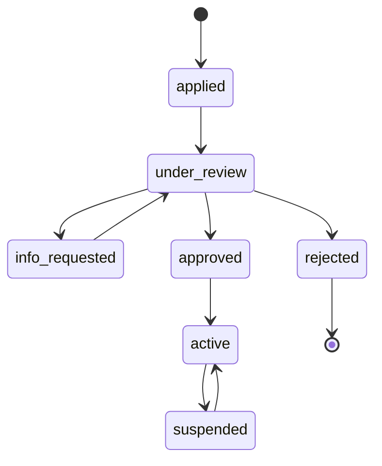
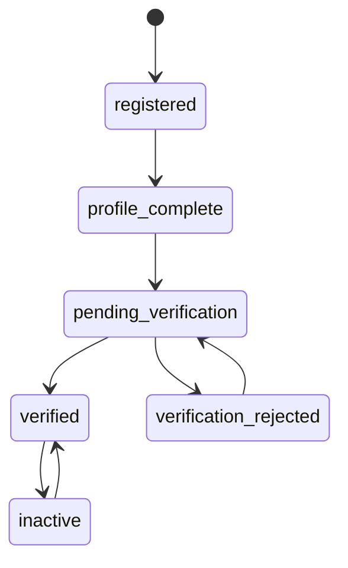
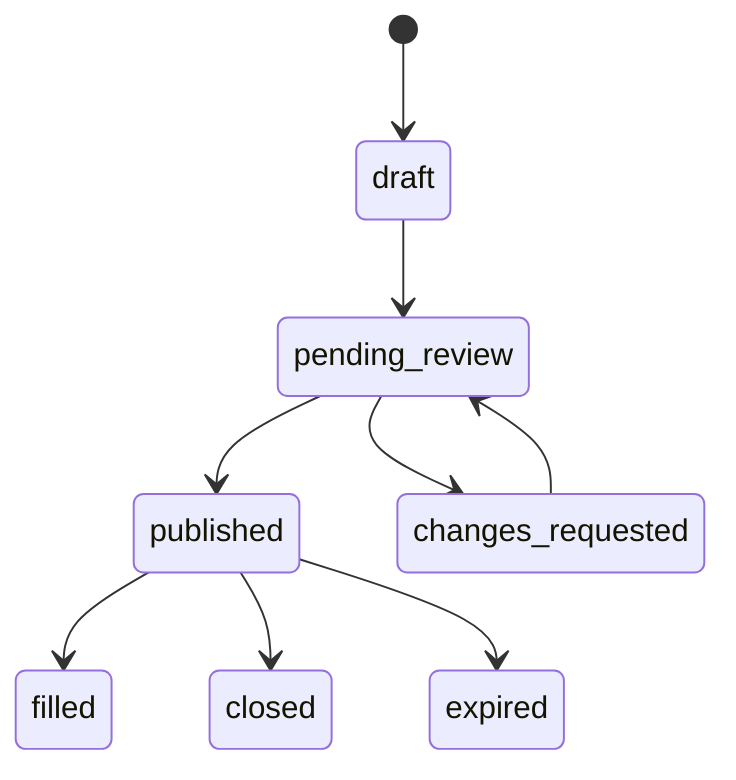
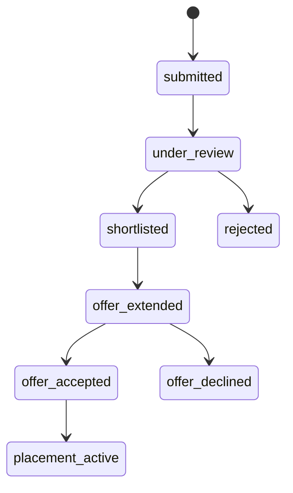
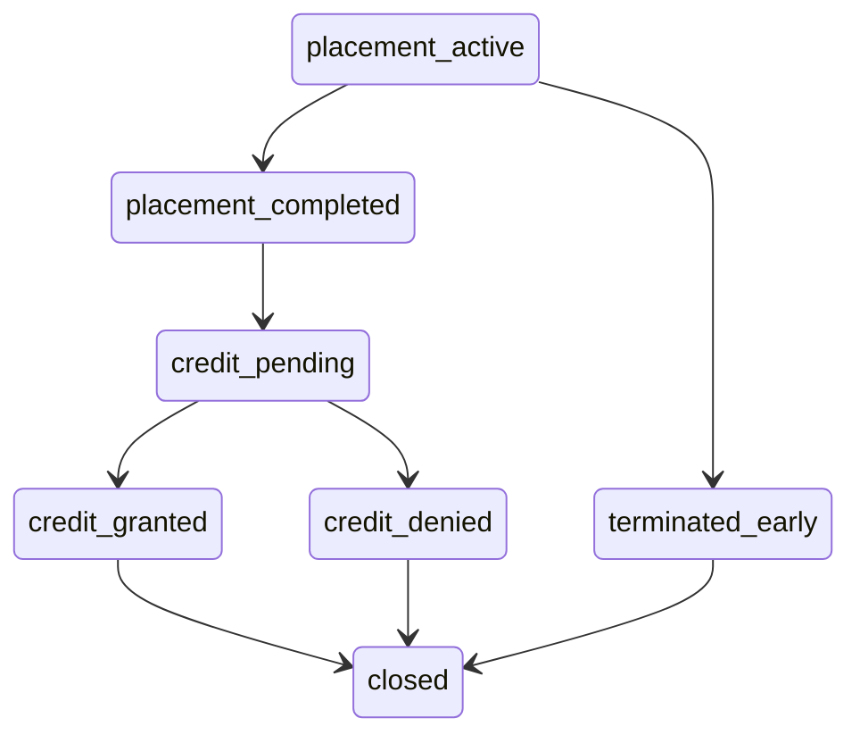

# Opportunity Ecosystem — End-to-End User Story

**Status:** Draft, under active revision.
**Purpose:** Pin down the complete lifecycle before writing application code, so the domain model and state machine are built once.

Open questions are marked **[Q#]** and collected at the end. Assumptions I made to keep the story moving are marked **[assumed]** — treat every one as a question I answered on your behalf.

---

## Settled

| | Decision |
|---|---|
| **Scope** | College-level credit only. High school stays modeled but dark. |
| **Who is a student** | Degree-seeking students earning credit. **No adult job seekers**, no unaffiliated career-changers — everyone has an institution. |
| **The point of the product** | Expanding internship-for-credit. Credit is the outcome, not a side benefit. |
| **Agency interview** | Once per applicant. Clearance travels with the student. *(Confirm: per-person, not per-application.)* |
| **Transportation** | The student's responsibility. Optional profile field at most; **not** a matching factor. |
| **Payments** | Out of scope entirely. |
| **Database** | Postgres. |
| **Primary customer** | The administrator. |

**Copy change this forces:** the landing page's "Job Seekers" card becomes "Students." There is no unaffiliated track.

---

## The two tracks

This is the defining structural feature of the product. There are two kinds of opportunity, and they are not the same shape.

| | **Standard Internship** | **Micro-Internship** |
|---|---|---|
| Credit | 3 credit hours | 1 credit hour |
| Duration | Semester or summer, 12–15 weeks | Days to a few weeks |
| Hours | ~135–150 | ~40 |
| Shape | An ongoing role with a supervisor | A discrete project with a deliverable |
| Model | Traditional internship | Parker Dewey style |
| Evaluation | Supervisor evaluation + student reflection | Deliverable accepted |

### Why this matters more than it looks

**The micro track cannot carry the standard track's process weight.** If a 40-hour project requires a state workforce interview, a formal offer, a negotiated credit arrangement, a midpoint check-in, and a final evaluation, the administrative overhead exceeds the work itself. Low friction *is* the value proposition of a micro-internship — Parker Dewey's whole model is that a company can post a project on Tuesday and have a student on it by Friday.

So the design cannot be one workflow with a duration field. It needs **workflow profiles**: one state machine, where the opportunity type declares which transitions are required and which are skipped. Standard runs the full path; micro runs a compressed one. Admin configures which steps each track requires rather than us hardcoding it.

That keeps a single transition table — the thing that makes the five portals coherent — while letting the two tracks feel appropriately different.

### The credit-hours floor

Standard Carnegie accounting puts **one college credit at roughly 45 hours of student work**. That does arithmetic on both tracks:

- 3 credits ≈ 135 hours. A semester internship at 10–12 hrs/week over 14 weeks lands at 140–168. Comfortable.
- 1 credit ≈ 45 hours. A 40-hour micro-internship is defensible. **A 10-hour one is not.**

Parker Dewey projects commonly run 10–40 hours, so a meaningful share of typical micro-projects fall below the credit threshold. Registrars will not wave this through.

**Implication:** every opportunity needs a minimum-hours requirement for credit eligibility, and that floor should be **institution-configurable**, because PSU's registrar and a partner institution's registrar may not set it in the same place. A posting below its institution's floor is either not credit-bearing or not postable. **[Q11]**

---

## The actors

| Actor | Who they are | What they own |
|---|---|---|
| **Admin** | The platform operator. The customer this is built for. | Vetting, oversight, intervention, reporting, configuration |
| **Student** | Degree-seeking college student | Their master profile, applications |
| **Employer** | Approved business hosting interns | Postings, candidate decisions, supervision |
| **Education** | PSU and partner institutions | Roster verification, credit awards, credit policy |
| **Agency** | KANSASWORKS / state workforce | Interview slots, workforce clearance |

**Admin is the only cross-tenant role.** Every other actor sees only their own organization's data. That exception is deliberate, and every cross-tenant read gets logged.

---

## Phase 0 — Onboarding an organization

Nothing exists until Admin lets it exist.

1. Admin configures the program: counties in scope, workflow profile per track, credit floors, SLA thresholds for stalled work.
2. An organization applies through a public form — legal name, state registration, county, org type, primary contact.
3. Admin vets it. For an employer, that it's a real, registered, in-good-standing Kansas business. For an institution, that it's real and accredited.
4. On approval the primary contact is invited to create an account and becomes that org's own admin, who can then invite colleagues.

This queue is the mockup's *"Pending Entity Vetting — 3 Organizations."* It is the trust foundation of the program: institutions will only participate if someone credible vetted the employers their students are sent to.

---

## Phase 1 — Student onboarding and verification

1. Student self-registers and selects their institution **from the list of already-approved institutions**. They can't invent one.
2. Student builds the **master profile** — built once, reused forever:
   - Program of study, standing, expected graduation
   - Skills, on a shared taxonomy **[Q6]**
   - Career interests
   - Availability: terms, hours per week
   - Resume, portfolio links
3. **The institution verifies them.** A staff member confirms: our student, this program, this ID, in good standing, eligible for internship-for-credit.
4. Verified students get the badge in the mockup. **Unverified students may browse but may not apply.** [assumed]

Guardian consent and under-18 PII gating are modeled in the schema but unreachable in the college-only product.

---

## Phase 2 — Employer posts an opportunity

The employer picks a track first, because it changes the form:

**Standard:** title, description, county and work arrangement, term and dates, hours per week, wage, required and preferred skills, credit hours available, supervisor, number of openings.

**Micro:** project title, deliverable description, estimated hours, deadline, compensation, required skills. No ongoing supervisor relationship, no term alignment.

**[Q1] Does Admin review every posting?** Auto-publish for approved employers, review-first-then-auto, or review everything. Given credit is attached, I'd lean to review-first-then-auto — but this is a staffing decision, so it should be configuration, not a hardcoded rule. Plausibly it differs by track: standard reviewed, micro auto-published.

---

## Phase 3 — Discovery and application

Students browse and search. Each opportunity shows a **match score** from skill overlap, availability, and credit fit.

Two rules about that score:
- It is **explainable** — stored with the factors that produced it and the algorithm version, because employers will ask "why 94%?" and someone will eventually audit it for bias.
- It **sorts, it never gates.** No student is filtered out of an employer's view by a score.

"1-Click Apply" works because the master profile already carries everything.

**[assumed]** The student's institution is notified when they apply — informational, not an approval step.

---

## Phase 4 — Employer review

Employer works the candidate pipeline: shortlist, reject, request more information.

The employer **does not see full contact PII at this stage.** That unlocks later in the flow. Field-level disclosure is a property of the profile, not of the screen rendering it.

---

## Phase 5 — Workforce clearance

**Resolved: once per applicant.** The student is interviewed once and carries the clearance to every application. Agency workload scales with *students*, not applications — the difference between a program that works at scale and one that collapses at fifty concurrent applications.

Open sub-questions: how long clearance lasts (a term? a year? until graduation?) **[Q12]**, and whether the micro track requires it at all **[Q13]**.

Clearance now sits on the **student**, not the application — which is why it no longer appears as a stage in the application flow above.

**[Q4] Where the gate sits relative to the hiring decision — deferred.** You're writing this up.

**[Q3] Who attends** — student only, or student and employer together — still open, though per-applicant clearance strongly implies student-only.

---

## Phase 6 — Offer and placement

**Standard:** employer extends an offer with role, wage, dates, hours, supervisor. Student accepts. Institution confirms the credit arrangement — how many credits, mapped to which course, with what learning objectives and which faculty supervisor.

**Micro:** employer selects a student for the project. Far lighter — a project assignment, not an offer negotiation. Whether the institution pre-approves each micro-project or blanket-approves the track is **[Q14]**.

---

## Phase 7 — The work happens

**Standard:**
- Student logs hours; supervisor approves.
- Midpoint check-in **[Q5]**.
- Supervisor completes an end-of-placement evaluation.

**Micro:**
- Student submits the deliverable by the deadline.
- Employer accepts it or requests revision.
- No hour logging, no midpoint, no formal evaluation — acceptance *is* the evaluation.

An **escalation path** exists on both tracks. Any party can raise a problem and it routes to Admin.

---

## Phase 8 — Credit and closeout

Institution reviews the evidence — hours and evaluation for standard, accepted deliverable for micro — and grants credit.

The credit award writes back to the student's profile as **verified completed experience**. That is the compounding value of the system: after several placements a student carries a work record that an institution and a state agency both attested to.

**[Q15] Do micro-internships stack?** Three 1-credit micro-internships summing to 3 credits is the obvious student question, and registrars will have an opinion. If they stack, `CreditAward` needs aggregation logic and a cap; if not, that's a rule to enforce at application time so nobody discovers it after the work is done.

---

## Phase 9 — Admin oversight (continuous, not sequential)

This runs across every phase above, and it is the product.

**Oversight.** One view of every application in flight across all parties. The useful version isn't a list — it's **exception-first**: what's stuck, who's sitting on a queue past SLA, which postings have no applicants, which students verified but never applied. Admin's job is unsticking things, so the screen leads with what's stuck.

**Vetting.** The org approval queue, plus visibility into student verification across institutions.

**Reporting.** Rolled up from the audit event log rather than computed ad hoc: placements by county and by track, credit hours granted, employer and institution participation, time-to-placement, funnel conversion at each stage. Standard-vs-micro comparison will be one of the most interesting numbers the program produces — and the strongest argument for the micro track's existence.

**Intervention.** Admin can nudge, reassign, or force a state transition — always with a reason, always logged.

**Audit.** Every transition writes an immutable event: who, what, when, why. This is also what makes the reporting free.

---

## Open questions

### New, from the two-track model

| # | Question | Why it matters |
|---|---|---|
| **Q11** | Minimum hours per credit — institution-configurable floor? | Many typical micro-projects fall under 45 hours and aren't creditable. Needs enforcing at posting time, not discovered at credit time |
| **Q13** | Does the micro track require workforce clearance? | If yes, overhead swamps a 40-hour project and the track's advantage evaporates |
| **Q14** | Does the institution approve each micro-project, or blanket-approve the track? | Per-project approval reintroduces the friction the track exists to avoid |
| **Q15** | Do micro-internships stack toward more credit? | Determines whether `CreditAward` needs aggregation and a cap |
| **Q12** | How long does workforce clearance last? | A term, a year, until graduation — drives re-clearance cycles |

### Still open from before

| # | Question | Status |
|---|---|---|
| **Q1** | Does Admin review every posting? | Open — probably configurable, possibly per-track |
| **Q3** | Interview: student only, or with employer? | Open — per-applicant clearance implies student-only |
| **Q4** | Where the gate sits vs. the hiring decision | **Deferred — you're writing this up** |
| **Q5** | Formal midpoint check-in on standard placements? | Open |
| **Q6** | Skills taxonomy — O\*NET or custom? | Open. O\*NET is federal, free, and state workforce systems speak it |
| **Q9** | Can one posting produce multiple placements? | Open. Near-certainly yes for micro |
| **Q10** | Does a profile follow a student between institutions? | Open |

### Resolved

**Q2** once per applicant · **Q7** transportation is the student's responsibility, not a match factor · **Q8** no adult job seekers, everyone is a credit-seeking student

---

## What this buys us

Once these land, the state machine becomes a single guarded transition table with a permission matrix — who may move what, from where, to where — plus a workflow profile per track declaring which transitions are required.

That table is the foundation. Build it right and the five portals are views over it. Build five portals first and you get five divergent truths.
